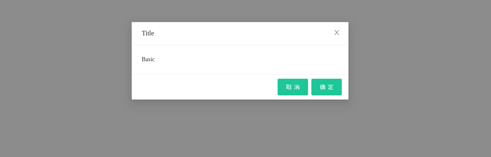

# Install

```
npm i -D @jakku001/react-spring-modal
```

# Overview




<a href="https://codesandbox.io/s/quirky-rgb-gh5r5e?fontsize=14&hidenavigation=1&theme=dark" target="_blank">
  
</a>

# Usage

```js
import React, { useState } from "react";
import Modal, { Button } from "@jakku001/react-spring-modal";

export default function App() {
  const [modalVisible, updateModalVisible] = useState(false);
  const handleClick = (e) => {
    updateModalVisible(true);
  };

  const handleCancel = () => {
    updateModalVisible(false);
  };

  return (
    <div>
      <Button onClick={(e) => handleClick(e)}>测试</Button>
      <Modal
        visible={modalVisible}
        title="标题"
        onCancel={(e) => handleCancel()}
      >
        <div>hello</div>
      </Modal>
    </div>
  );
}
```

# Props

|参数|说明|类型|默认值|
|--|--|--|--|
|onCancel|取消回调|function|-|
|onOk|确定回调|function|-|
|mask|是否展示遮罩|boolean|true|
|maskClosable|点击蒙层是否允许关闭|boolean|true|
|closable|是否显示右上角的关闭按钮|boolean|true|
|title|标题|string|-|
|visible|对话框是否可见|boolean|-|
|footer|底部内容|Array\<ReactNode\>|-|

